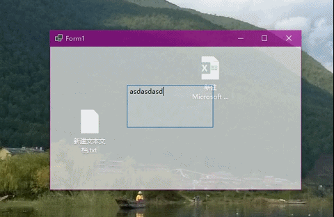
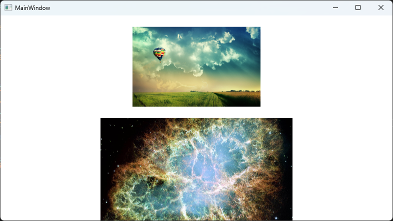

## DotNET code samples for my blog.
***
### Beauty Of CSharp 
Blog : [C#语言之美系列](http://blog.cyclone.vorcyc.com/Post-Group/34769d9a-d609-4746-be5a-82d4f34c7a54)

### Interactive Graph 
blog : [交互式图形学 GDI+ C#](http://blog.cyclone.vorcyc.com/Posts/2022_01_17_interactive-graphics-example)

### PInvoke Custom Native Code
blog : [写个C库给.NET用](http://blog.cyclone.vorcyc.com/Posts/2022_01_07_Write-a-C-library-for.NET)  
blog : [用SSE深度优化C库](http://blog.cyclone.vorcyc.com/Posts/2022_01_10_Deep-Optimize-the-dotnet-library-with-SSE)

### Click Through Window

### Managed and unmanaged pointer

### WpfInteractiveWithOtherGraphicFramework
blog : [如何让其它图形框架的图像在WPF程序中显示](https://mp.weixin.qq.com/s/gY_cvW9ZDIOOy9M1MlcFsA)
